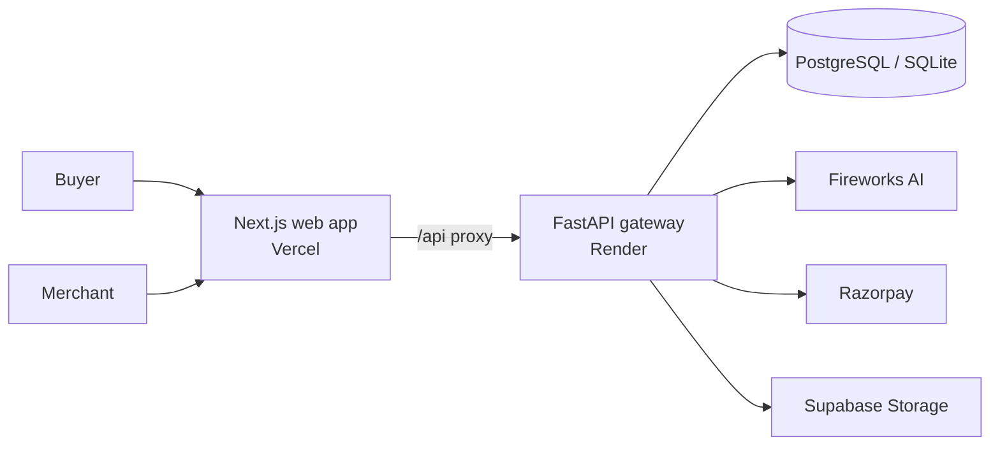

# AI Commerce Gateway

**A governed AI shopping experience that turns product discovery into safe, auditable commerce.**

[Open the live app](https://ai-commerce-zeta.vercel.app) · [Try the buyer experience](https://ai-commerce-zeta.vercel.app/buyer) · [Open the merchant AI catalog](https://ai-commerce-zeta.vercel.app/merchant/ai-catalog) · [API health](https://ai-commerce-zeta.vercel.app/api/health/live)

AI Commerce Gateway is more than a shopping chatbot. It gives buyers a natural-language assistant for finding products and preparing a purchase, while keeping merchants in control through policy checks, explicit approval, payment verification, and a complete audit trail.

## Why it stands out

Most AI shopping demos stop at a recommendation. This project handles the difficult part: making an AI-assisted transaction trustworthy.

- **AI with boundaries:** the assistant can search the catalog and create a proposal, but it cannot silently purchase on a buyer’s behalf.
- **Merchant control:** every proposal is evaluated against merchant-defined rules; exceptions are routed to a review queue.
- **Payment integrity:** checkout is handled through Razorpay with server-side signature verification and idempotent processing.
- **Auditable by design:** a governed transaction state machine records the journey from proposal through payment.
- **MCP-ready interoperability:** compatible external AI clients can use the same narrow commerce operations through Model Context Protocol adapters—without bypassing the transaction controls.
- **Real product surface:** separate buyer and merchant experiences are built as a polished Next.js application backed by a FastAPI service.

## The experience

| Buyer | Merchant | Platform |
| --- | --- | --- |
| Describe what you need in plain language and compare matching products. | Create and enrich catalog listings with AI assistance. | Enforces the lifecycle, authorization, policy rules, and payment verification. |
| Review a transparent purchase proposal before authorizing it. | Set automatic approval limits and review exceptions. | Keeps pricing, stock, and transaction state server-authoritative. |
| Complete checkout through Razorpay. | Track decisions and transactions from one dashboard. | Prevents duplicate charges with idempotency and webhook safeguards. |

## Architecture



The frontend keeps browser requests on one origin through a Next.js API proxy. The backend follows a domain-driven structure: API routes orchestrate application services, which apply catalog, policy, and transaction-state rules before using external providers.

### A controlled transaction lifecycle

```text
PROPOSED → BUYER_AUTH_REQUIRED → POLICY_EVALUATION
                                      ├─ auto-approved → PAYMENT_PENDING → PAID
                                      └─ exception     → MERCHANT_REVIEW_REQUIRED
```

That lifecycle is intentional: an LLM may help assemble a proposal, but buyers authorize it, merchant policy decides whether it can advance, and the server verifies payment before recording success.

## AI and MCP, without giving away control

The reference buyer chat is the main experience, but the same application services can be exposed to MCP-capable AI clients. MCP is an interoperability adapter, not a payment engine: it can discover products and create controlled proposals, while the trusted backend still owns pricing, buyer consent, merchant-policy evaluation, Razorpay execution, and the audit record.

This separation lets the platform support future AI channels without duplicating commerce logic or allowing a model to call payment providers directly.

## Tech stack

- **Frontend:** Next.js 16, React 19, TypeScript, Tailwind CSS, shadcn/ui
- **Backend:** Python 3.12+, FastAPI, SQLAlchemy, Alembic, Pydantic
- **AI:** Fireworks AI using an OpenAI-compatible API
- **Payments:** Razorpay Orders, checkout, webhook/signature verification
- **Data and media:** PostgreSQL or SQLite; Supabase Postgres and Storage supported
- **Deployment:** Vercel for the web app and Render for the FastAPI service

## Run locally

### Prerequisites

- Python 3.12 or newer
- Node.js 20 or newer
- A Fireworks API key for AI features
- Razorpay and Supabase credentials if you want to exercise payments and file storage

### 1. Start the backend

```powershell
uv sync
Copy-Item .env.example.example .env
# Add your local values to .env. Never commit this file.
uv run uvicorn ai_commerce_gateway.api.app:app --host 127.0.0.1 --port 8000 --reload
```

On Windows, use `./scripts/dev.ps1 backend` for the same backend startup shortcut.

### 2. Start the frontend

```powershell
cd frontend
npm install
npm run dev
```

The frontend defaults to `http://127.0.0.1:8000` for the backend. For a different API origin, set `BACKEND_ORIGIN` in `frontend/.env.local`. The Windows helper uses port 8001, so keep its matching local override when using that shortcut.

Open [http://localhost:3000](http://localhost:3000). On Windows, `./scripts/dev.ps1 frontend` starts the frontend shortcut.

## Validate the project

```powershell
# Backend tests
uv run pytest

# Frontend quality checks and production build
cd frontend
npm run lint
npm run build
```

## Deploy

The public deployment uses Vercel for the Next.js frontend and Render for the FastAPI backend.

- **Web app:** [ai-commerce-zeta.vercel.app](https://ai-commerce-zeta.vercel.app)
- **Backend health:** [ai-commerce-backend-bgc3.onrender.com/health/live](https://ai-commerce-backend-bgc3.onrender.com/health/live)
- **Render blueprint:** [`render.yaml`](render.yaml)
- **Deployment guide:** [`docs/DEPLOYMENT.md`](docs/DEPLOYMENT.md)

Production environment values belong in the Vercel and Render dashboards, never in Git. Configure `BACKEND_ORIGIN` on Vercel, plus the backend’s `DATABASE_URL`, Fireworks, Razorpay, Supabase, storage, and session-secret settings on Render. Use hosted PostgreSQL and strong production session secrets rather than the local SQLite defaults.

## Repository map

```text
frontend/                         Next.js buyer and merchant experiences
src/ai_commerce_gateway/
  api/                            FastAPI routes and request handling
  application/                    orchestration services and use cases
  domain/                         catalog, policy, and transaction rules
  infrastructure/                 database and provider adapters
docs/                             architecture, API, deployment, and runbooks
render.yaml                       Render production blueprint
```

For deeper technical detail, see [`docs/ARCHITECTURE.md`](docs/ARCHITECTURE.md), [`docs/API.md`](docs/API.md), [`docs/SECURITY.md`](docs/SECURITY.md), [`docs/TESTING.md`](docs/TESTING.md), and [`docs/DEPLOYMENT.md`](docs/DEPLOYMENT.md).

## The pitch

AI Commerce Gateway demonstrates a practical answer to a hard question: **how do you let AI make commerce faster without letting it make commerce reckless?**

It combines a familiar conversational buying flow with the controls a real merchant needs—clear buyer consent, configurable policy gates, verified payments, and traceable decisions. That makes it a strong foundation for AI-assisted storefronts, B2B procurement workflows, and marketplaces where trust matters as much as conversion.
